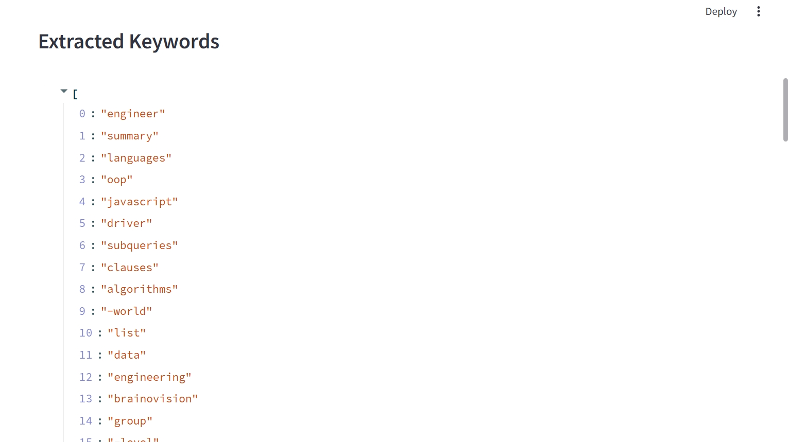

# Resume Analyzer App

An intuitive web application designed to help HR teams streamline the resume screening process. The app allows users to upload PDF resumes, automatically extracts key skills and relevant information using Natural Language Processing (NLP), and stores the data in a database for easy searching and management.

Built with Python, Streamlit, and SQLite, this project showcases full-stack development skills and solves a practical real-world problem in recruitment.

---

## Features

- Upload resumes in PDF format through a clean and simple Streamlit interface.
- Extract text content from resumes using `PyPDF2`.
- Extract key skills and keywords using NLP libraries (`spaCy` or `nltk`).
- Store extracted information and candidate details in an SQLite database.
- View extracted text and keywords instantly within the app.
- Easily extensible to include advanced features such as job matching and resume ranking.

---

## Tech Stack

- **Python**: Core programming language.
- **Streamlit**: Frontend UI framework for building interactive web apps.
- **SQLite**: Lightweight SQL database for persistent data storage.
- **PyPDF2**: PDF text extraction.
- **spaCy / nltk**: Natural Language Processing libraries for keyword extraction.

---

## Installation and Setup

1. **Clone the repository:**

   ```bash
   git clone https://github.com/your-username/resume-analyzer-app.git
   cd resume-analyzer-app

## Demo Screenshot

Here is how the Resume Analyzer Extracted Keywords looks



